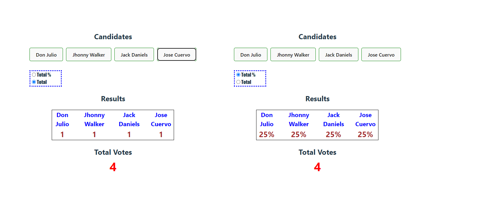

# Make It Real - All about context

## This is a solution to the _Context_ project of the Make It Real course.

## The challenge

All About Context

## Vercel page

Production: https://frontend-topv29-restaurantes.vercel.app/

## Screenshot

## Our process

### Built with

- Semantic markup using vscode editor
- React code using vite in vs code
- CSS properties in a stylesheet file
- React Router library
- Bem Notation css

## What We learned

I practice html, css, react and js

## Authors

Juan David Peña - Miguel Chaparro - Alex Herrera
github - @juandape - @miguelchaparrocolo - @guialexander
email - juandavidp76@hotmail.com - -

## Acknowledgments

Thanks to Make it Real to show us a path to become a better programmers
